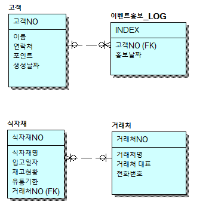
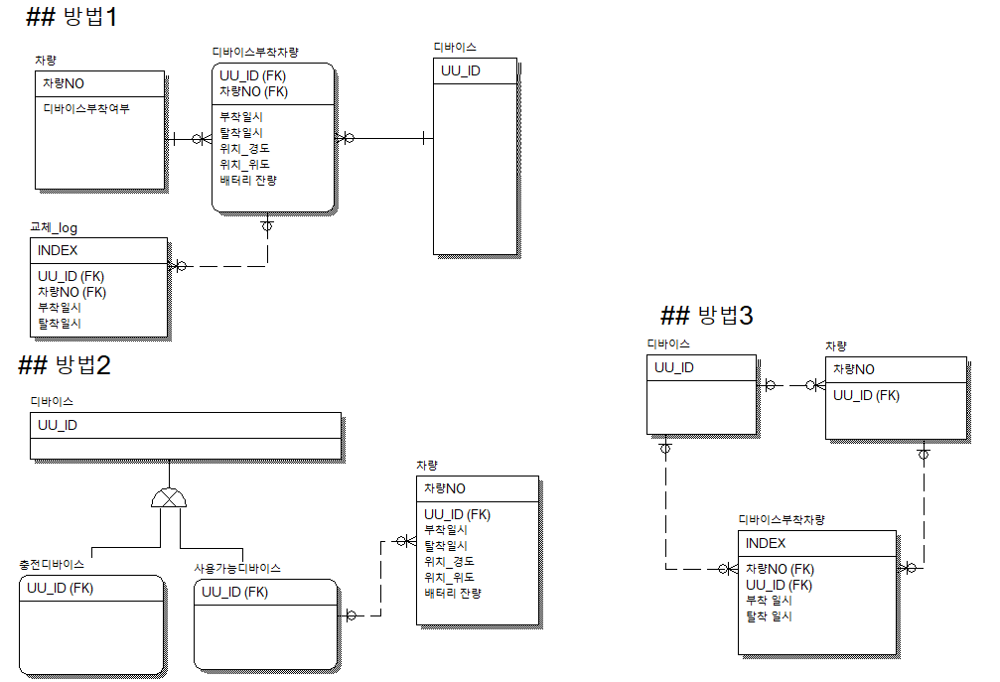

# 2022.02.24

### Modeling Example 1

상원이는 카페를 차렸다.   
혼자 카페를 관리하는 DB시스템을 만들려고 한다.   
*** 요구 사항은 아래와 같다.   
1. 고객 데이터는 이름, 연락처, 포인트, 생성날짜만 필요하다.   카페 정보,메뉴 정보 데이터는 DB로 관리 X

2. 포인트가 1000점이 넘는 고객들은 매달 SMS로 이벤트 홍보를 보내고 싶고, 그 기록을 DB에 남기고 싶다.

3. 카페에 들어오는 식자재를 DB로 관리하고 싶다.   언제 들어 왔는지 유통기한은 언제까지인지 등등

4. 식자재 거래처도 DB로 관리하고 싶다.

### Modeling Example 2

차량 관리 시스템   

요구 사항   
1. 차에 위치 추적 장치(이하 디바이스라 칭함)를 부착해야 한다.
2. 디바이스는 차량당 1대만 부착할 수 있다.
3. 디바이스 배터리가 0%가 되면 다른 디바이스로 교체가 된다. 
4. 어떤 차에 어떤 디바이스가 교체 되고 부착되었는지 한눈에 보고 싶다.

- 이게 맞나 내일 확인!