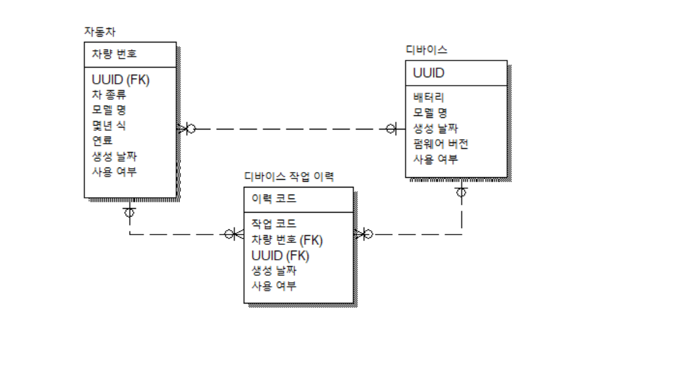
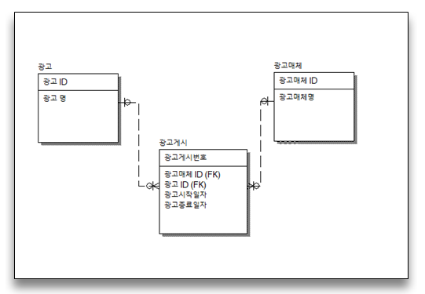

# 2022.02.25

### Modeling (Car location device Modeling)

차량 관리 시스템   
- 요구 사항   
1. 차에 위치 추적 장치(이하 디바이스라 칭함)를 부착해야 한다.
2. 디바이스는 차량당 1대만 부착할 수 있다.
3. 디바이스 배터리가 0%가 되면 다른 디바이스로 교체가 된다. 
4. 어떤 차에 어떤 디바이스가 교체 되고 부착되었는지 한눈에 보고 싶다.
#### 정답

 

###  아래는 어느 회사의 광고에 대한 데이터 모델이다. 다음 중 광고매체 ID별 최초로 게시한 광고명과 광고시작일자를 출력하기 위하여 아래 ( )에 들어갈 SQL로 옳은 것은?

   
```sql
SELECT 
FROM 광고게시 A, 광고 B,  광고매체 C
(                       ) D
WHERE A.광고시작일자 = D.광고시작일자
AND A.광고매체ID = D.광고매체ID
AND A.광고ID = B.광고ID
AND A.광고매체ID = C.광고매체ID
ORDER BY C.광고매체명; 
```
1. SELECT D.광고매체ID, MIN(D.광고시작일자) AS 광고시작일자
FROM 광고게시 D
WHERE D.광고매체ID = C.광고매체ID
GROUP BY D.광고매체ID
2. SELECT 광고매체ID, MIN(광고시작일자) AS 광고시작일자
FROM 광고게시
GROUP BY 광고매체ID
3. SELECT D.광고매체ID, MIN(D.광고시작일자) AS 광고시작일자
FROM 광고게시 D
GROUP BY D.광고ID
4. SELECT D.광고매체ID, MIN(D.광고시작일자) AS 광고시작일자
FROM 광고게시 D
        정답 : 2
        FROM 절의 서브쿼리
        이기 때문에
        1. ID별 (GROUP BY 광고매체ID)
        2. From절이 먼저 실행되기 때문에 안의 서브쿼리에서 As Something을 사용할 수 없다.


## SQL과정 중 모델링을 통해 혼자 모델링 과정 및 결과를 포트폴리오에 첨부해보았다.