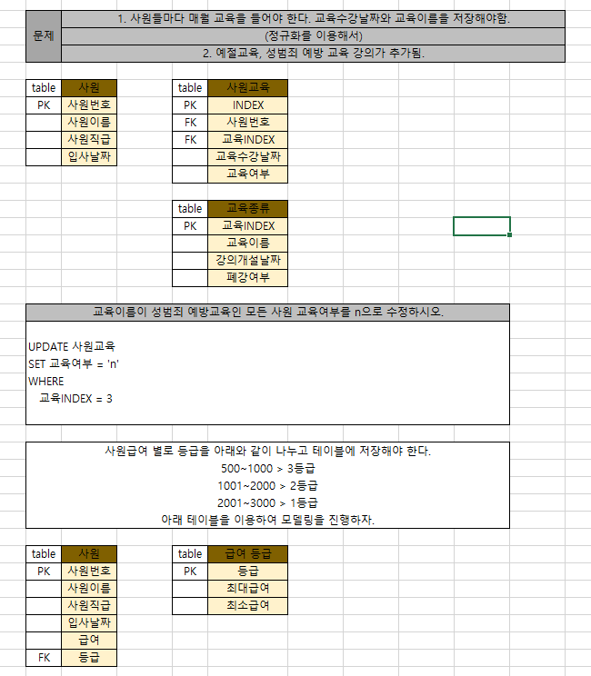
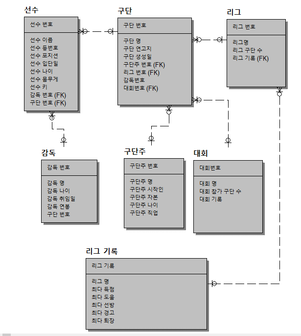
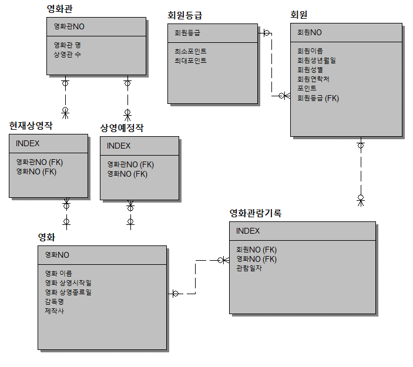

# 2022.02.22

## SQL


### EXISTS
- EXISTS
```sql
SELECT
    *
FROM emp
WHERE EXISTS(
    SELECT *
    FROM emp
    WHERE
        job = 'MANAGER'
)
```
> 서브쿼리 내의 데이터가 있으면 TRUE, 없으면 FALSE를 반환.

- NOT EXISTS
```sql
SELECT 
    ename
FROM emp
WHERE NOT EXISTS(
    SELECT ename
    FROM emp
    WHERE empno=7356
)
```
> 반대로 데이터가 있으면 FALSE, 없으면 TRUE

- 이럴 때 사용
```sql
UPDATE 백업실행
SET 백업날짜 = '220222'
WHERE EXISTS(
    SELECT * FROM 입출급내역
)
```
- 서브쿼리 데이터 여부에 따라 실행 판단.

### MODELING
- 테이블에 null값이 많으면 정규화(모델링) 고려대상
- UPDATE : DELETE -> INSERT
- EXCEL로 연습


- PRIMARY KEY(PK)
> 중복 허용 X   
> 자동으로 INDEX가 붙음.

- FOREIGN KEY(FK)
> 중복 허용 O   
> INDEX가 붙지 않음.   
> INDEX를 생성해야함.(시간, 효율적으로 사용하기 위해서)
```sql
CREATE INDEX 인덱스명
ON 테이블명 (컬럼명1, 컬럼명2, ...)
;
```

- UNIQUE KEY
> 중복 허용을 하고싶지 않으면   
```sql
CREATE TABLE emp(
    deptno int,
    UNIQUE KEY emp(deptno)
)
CREATE TABLE emp(
    deptno int UNIQUE KEY 
)
```

## SCOOER TABLE MODELING

## MOVIE TABLE MODELING


### 트리거(TRIGGER)
- SQL 내에서 data를 수정/UPDATE 등 코딩하는 방법

### 역정규화
- table 이 1대1관계 이거나 data가 몇 개 없어 table을 합칠 때